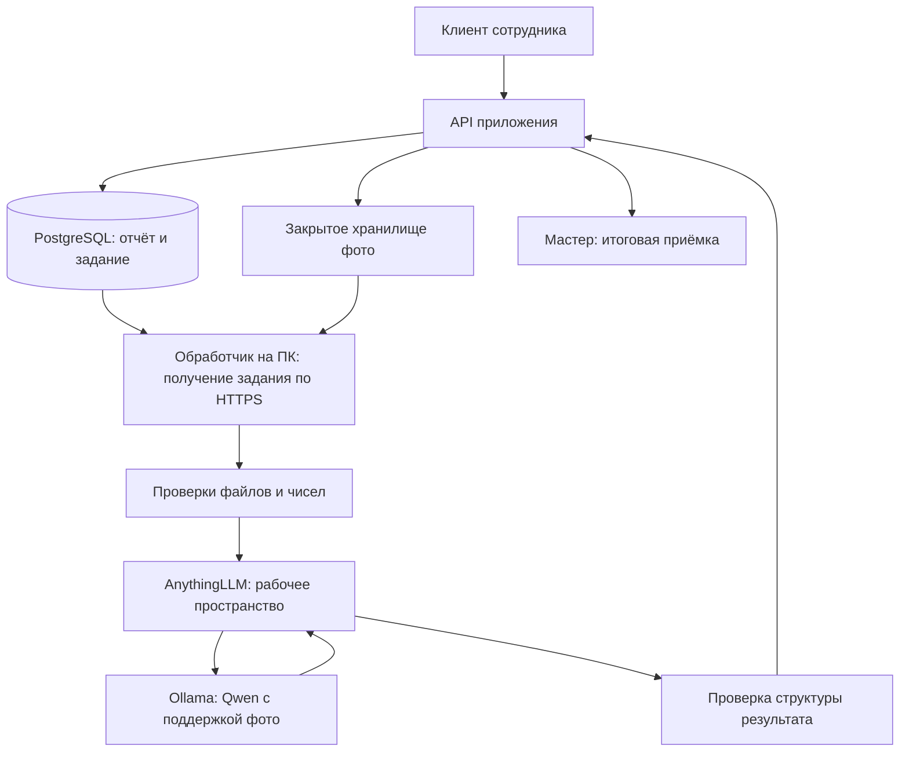

# ИИ-центр «НарядAI»: исследование и рекомендации

Дата: 4 октября 2026 года. Срок первичного просмотра, заданный командой: 8 октября. Компьютер ИИ: RTX 3060 12 ГБ, ОЗУ 16 ГБ DDR4 2667. Это предложения к проекту, без изменения кода, установки моделей или развёртывания сервисов. Производительность моделей на фотографиях команды пока не измерена.

## 1. Рекомендация для вашей конфигурации

Начать с AnythingLLM + Ollama + **Qwen 3.5 9B Q4_K_M**, используя одну мультимодальную модель для отчёта и фотографий. Если требуется отдельная модель для фото — сравнить **Qwen3-VL 8B Instruct Q4_K_M** с ней на одинаковых примерах. Независимый вариант другого разработчика — **Gemma 4 E4B Q4_K_M**. Для облегчённого режима оставить Qwen 3.5 4B.

Qwen 3.5 9B принимает текст и изображения; карточка разработчика указывает Apache 2.0. Поэтому отдельная vision-модель не обязательна для первой рабочей цепочки. [Карточка Qwen](https://huggingface.co/Qwen/Qwen3.5-9B). Предложение одной модели основано на сокращении интеграций и переключений памяти перед дедлайном; оно не доказывает её превосходство на промышленном контроле.

| Кандидат и точный тег Ollama | Размер пакета по каталогу | Роль в проекте | Компромисс |
|---|---:|---|---|
| `qwen3.5:9b-q4_K_M` | 6,6 ГБ | Первый кандидат для текста и фото | Общая модель; качество конкретных дефектов требуется проверить |
| `qwen3-vl:8b-instruct-q4_K_M` | 6,1 ГБ | Отдельная проверка видимого содержимого фото | Дополнительный проход и переключение модели при отдельном текстовом анализе |
| `gemma4:e4b-it-q4_K_M` | 6,6 ГБ | Альтернатива Qwen от Google | Требует отдельной проверки русского ответа, формата и предметного качества |
| `qwen3.5:4b-q4_K_M` | 3,3 ГБ | Резерв при нехватке памяти или слишком долгой обработке | Более компактная модель; качество нельзя считать равным 9B заранее |

Размеры и поддержка изображений проверены в каталогах [Qwen 3.5](https://ollama.com/library/qwen3.5/tags), [Qwen3-VL](https://ollama.com/library/qwen3-vl/tags), [Gemma 4](https://ollama.com/library/gemma4/tags). Это размеры файлов, **не требуемая VRAM**: дополнительно нужны память контекста, обработка изображений и служебные буферы. Карточки [Qwen3-VL](https://huggingface.co/Qwen/Qwen3-VL-8B-Instruct) и [Gemma 4](https://ai.google.dev/gemma/docs/core/model_card_4) также указывают Apache 2.0. Локальные запросы не требуют оплаты облачного API; вычисления используют ваш компьютер.

SmolVLM2 2.2B рассмотрен как компактный запасной вариант, но его карточка обозначает английский язык. Для русскоязычной команды и текущего железа я не выбирал бы его первым. [Карточка Hugging Face](https://huggingface.co/HuggingFaceTB/SmolVLM2-2.2B-Instruct).

## 2. Память и запуск на RTX 3060

RTX 3060 прямо входит в список поддерживаемых видеокарт Ollama. [Поддержка оборудования](https://docs.ollama.com/gpu). Модели 8–9B Q4 — разумные кандидаты для 12 ГБ VRAM, но размещение полностью на GPU нужно подтвердить фактическим запуском.

Стартовые настройки, предлагаемые для испытаний:

- Один обрабатываемый отчёт и одна загруженная модель.
- Контекст 8–16 тысяч токенов для короткого отчёта; начать с одной-двух фотографий. Для больших пакетов измерить необходимость увеличения контекста или отдельной обработки каждого фото.
- Краткий итог с фиксированными полями. Поддержку отключения thinking проверить через `/api/show` и сравнить скорость и качество обоих режимов. [Управление thinking](https://docs.ollama.com/capabilities/thinking).
- При переключении моделей освобождать память; ограничить `OLLAMA_MAX_LOADED_MODELS=1` и `OLLAMA_NUM_PARALLEL=1`. Проверять GPU-размещение через `ollama ps`. Эти параметры и выгрузка через `keep_alive` описаны в [FAQ Ollama](https://docs.ollama.com/faq).
- 16 ГБ системной памяти требуют контроля общего потребления Windows, AnythingLLM, модели и браузера. ОЗУ 2667 не позволяет предсказать скорость без CPU, размера изображений и настроек. Решение о расширении памяти принимать после измерений.

Команды для будущего сравнения; в рамках исследования они не выполнялись:

```powershell
ollama pull qwen3.5:9b-q4_K_M
ollama pull qwen3-vl:8b-instruct-q4_K_M
```

После выбора зафиксировать версию Ollama, тег и digest модели, версию AnythingLLM, параметры и версию инструкции. Теги могут обновляться; версия, показанная на защите, должна совпадать с проверенной.

## 3. Что означает «AnythingLLM — головной центр»

AnythingLLM подходит как управляемая точка настройки моделей, рабочих пространств, базы документов и инструментов. Ollama исполняет модель; модель выполняет смысловой анализ. AnythingLLM предоставляет API рабочих пространств, а документация конкретного установленного экземпляра находится по `/api/docs`. [API AnythingLLM](https://docs.anythingllm.com/features/api), [подключение Ollama](https://docs.anythingllm.com/setup/llm-configuration/local/ollama).

Права пользователей, очередь заданий, статусы нарядов, контроль времени, расчёты и сохранение результата должны оставаться в backend. Запрос к модели возникает после сохранения отчёта, а не блокирует его загрузку. Финальную приёмку и оценку выполняет мастер — это требование исходного кейса.

Предлагаемая цепочка с одной моделью:



Стрелки показывают поток данных; PostgreSQL не обязан открывать сетевое подключение к домашнему ПК. Обработчик сам получает задания через API, как предусмотрено текущим кодом.

Если остаются две модели, последовательность задаётся явно: проверка файлов → vision-вывод → сопоставление с нарядом и нормами → предварительный итог. Model Router AnythingLLM умеет выбирать модель по правилам, включая наличие изображения, но один выбор модели не реализует всю эту последовательность. Для взаимодействия с отдельным сервисом есть блок API Call в Agent Flows. [Model Router](https://docs.anythingllm.com/model-router/overview), [API Call](https://docs.anythingllm.com/agent-flows/blocks/api-call). Перед 8 октября предпочёл бы существующий Python-обработчик с явной последовательностью, без ещё одного слоя оркестрации.

## 4. Что уже имеется в «патче 1.4»

Проверена рабочая копия ветки `codex/allur-ui-motion`, коммит `4f39609`, основанная на `cloud-1.4`.

| Файл | Что подтверждает чтение кода | Что ещё проверить |
|---|---|---|
| `server/postgres.py` | PostgreSQL-адаптер через psycopg | Реальные транзакции и данные развёрнутой БД |
| `server/remote_jobs.py` | Сохранённая очередь, временное право обработки задания, heartbeat и передача мастеру при сбое | Восстановление после отключения ПК и просроченного задания |
| `worker.py` | Получение отчётов и фото по HTTPS, вызов AnythingLLM, возврат результата | Сквозной вызов настоящей модели |
| `server/anythingllm.py` | API рабочего пространства, вложения изображений, сокращение фото до 1280 px, проверка JSON | Что установленная версия и выбранная модель действительно видят фото |
| `server/config.py` | Отправка изображений управляется `send_images`, по умолчанию `False` | Включить в настройках только после проверки мультимодальной цепочки |

В официальном коде провайдера Ollama AnythingLLM вложения преобразуются в поле `images`; такая интеграция предусмотрена. Это не заменяет испытание вашей установленной версии. [Исходный код провайдера](https://github.com/Mintplex-Labs/anything-llm/blob/master/server/utils/AiProviders/ollama/index.js).

Сейчас в запрос идут фото конкретного отчёта; отдельная пара «до/после» явно не собирается. Нет оснований утверждать, что сравнение выполнено уже сейчас. Оценка в текущей инструкции характеризует полноту и качество отчёта; её нельзя представлять как подтверждённое качество ремонта.

## 5. PostgreSQL, фото и документы

Если команда использует Supabase, PostgreSQL уже входит в этот сервис. Вторую БД с теми же нарядами создавать не требуется. [Supabase Database](https://supabase.com/docs/guides/database/overview).

Рекомендую распределить данные так:

- PostgreSQL: роли, люди, оборудование, справочники, наряды, события, списания, нормы, очередь, выводы ИИ, окончательная оценка и её автор.
- Закрытое файловое хранилище: оригиналы изображений. В таблице фото — ссылка/ключ, тип «до/после», автор, серверное время загрузки, метаданные и хеши. Supabase Storage подходит к уже заложенной интеграции. [Документация Storage](https://supabase.com/docs/guides/storage).
- AnythingLLM: рабочие пространства и поиск по утверждённым инструкциям. Его стандартное векторное хранилище — LanceDB. [LanceDB в AnythingLLM](https://docs.anythingllm.com/setup/vector-database-configuration/local/lancedb).

Для семантического поиска документов можно использовать локальные embeddings BGE-M3. Ollama предлагает этот многоязычный embedder; AnythingLLM умеет подключать Ollama для embeddings. [BGE-M3](https://ollama.com/library/bge-m3), [Ollama Embedder](https://docs.anythingllm.com/setup/embedder-configuration/local/ollama). На ваших русских/казахских текстах качество поиска нужно проверить. RAG — подбор фрагментов документов для запроса, а не обучение модели.

Нормативы и точные числа брать из справочников по идентификаторам. Просрочку, расход, баллы рейтинга и агрегаты рассчитывать Python/SQL. Модель объясняет готовый расчёт и выделяет смысловые несоответствия. Время ожидания ИИ после «Исполнено» не добавлять к просрочке исполнителя.

Встроенный SQL Agent AnythingLLM рекомендуется подключать только с правами чтения; документация предупреждает, что инструкция «только SELECT» сама по себе не запрещает запись. [SQL Agent](https://docs.anythingllm.com/agent/usage/sql-agent). Для MVP предпочтительнее ограниченные методы backend: сводка смены, история оборудования, сравнение с нормативом. pgvector пригодится при собственной реализации поиска, но текущий путь AnythingLLM не требует его добавления.

## 6. Проверка фото: два слоя

Первый слой — точные или эвристические проверки файлов:

1. Наличие обязательного фото после для внеплановой работы. Для плановой работы правила отличаются.
2. Валидность изображения, размер, ориентация и пригодность для просмотра.
3. Серверное время получения и доступные EXIF. Отсутствие EXIF не равно подделке; EXIF редактируется. Pillow предоставляет чтение и запись этих данных. [Pillow EXIF](https://pillow.readthedocs.io/en/stable/reference/Image.html#PIL.Image.Exif).
4. SHA-256 для побайтового совпадения с сохранёнными изображениями.
5. Перцептивный хеш для похожих изображений после изменения размера или сжатия. ImageHash поддерживает pHash и другие варианты. [ImageHash](https://github.com/JohannesBuchner/imagehash). Похожесть — основание показать пару мастеру, а не автоматически обвинить сотрудника. Пороги подобрать по разным ракурсам одного оборудования и реальным повторам.

Второй слой — смысловой анализ мультимодальной моделью:

- Что видимо на фото и соответствует ли оно описанию наряда.
- Читается ли маркировка, совпадает ли наблюдаемая маркировка с оборудованием.
- Какие изменения видны между предоставленными сопоставимыми кадрами.
- Чего на фото не видно и какой информации не хватает мастеру.

Модель должна отдельно формулировать наблюдение, предположение и невозможность проверки. По наружному фото нельзя подтвердить внутреннюю исправность, скрытую трещину, правильный момент затяжки или успешный функциональный тест. Дообучение на промышленных дефектах требует размеченных данных; общие бенчмарки модели не являются вашим измерением точности.

Сохранять оригинал для проверки метаданных и истории; уменьшенную копию отправлять модели. При необходимости номера оборудования сначала сопоставлять по QR/штрихкоду или OCR, а модель использовать для объяснения. Для отдельного OCR рассмотрен PaddleOCR с моделью кириллицы; это дополнительный компонент, который стоит вводить только при проверенной необходимости. [Модели OCR](https://www.paddleocr.ai/latest/en/version3.x/pipeline_usage/OCR.html).

## 7. Результат и пользовательский опыт

Предлагаемые поля результата: `report_id`, `model`, `prompt_version`, фактические проверки, наблюдения по конкретным `photo_id`, недостающие данные, предварительная оценка, признак необходимости ручной проверки, время анализа. Версия и фото нужны для воспроизводимости замечания.

Пример отображаемого заключения: «Похожее фото найдено в отчёте ОТ-0127. Откройте сравнение. На новом снимке не читается маркировка, соответствие оборудованию не подтверждено». Под ним — две фотографии, ссылка на прежний наряд и действия мастера.

Не показывать самооценку LLM «уверенность 97%» как измеренную вероятность. До калибровки полезнее показывать причины неопределённости: размытое фото, нет кадра до, маркировка скрыта, нужный узел вне кадра. Если данных недостаточно, фотооценка может быть пустой, а итог — «нужна проверка мастера».

Сервер проверяет структуру и значения ответа. При прямом вызове Ollama можно передать JSON Schema; поддержка есть и у vision-запросов. Это фиксирует формат, но не делает выводы фактически правильными. [Structured Outputs](https://docs.ollama.com/capabilities/structured-outputs). Для Python рекомендуется Pydantic. [Модели Pydantic](https://pydantic.dev/docs/validation/latest/concepts/models/). Передачу схемы через AnythingLLM отдельно проверить: нынешний вызов приложения ограничивается инструкцией и проверкой полученного JSON.

Интерфейс показывает этапы «отчёт сохранён», «в очереди», «проверяется», «готово для мастера», «ИИ недоступен — ручная проверка». Отключённый ПК не должен терять отчёт. Текст сотрудника и текст, распознанный на изображении, считаются входными данными, а не командами изменить балл или вызвать инструмент.

## 8. Полезные инструменты и приоритет

| Инструмент | Конкретная польза | Решение перед 8 октября |
|---|---|---|
| Ollama | Локальный запуск выбранных моделей и наблюдение за памятью | Использовать |
| AnythingLLM | Настройка рабочего пространства, моделей и документов | Использовать существующее подключение |
| FastAPI + psycopg | API и PostgreSQL | Сохранить текущий путь, проверить интеграцию |
| Supabase Storage либо локальное закрытое хранилище | Фото отдельно от табличных данных | Выбрать один рабочий режим демо |
| Pillow + hashlib + ImageHash | Метаданные, оригиналы, точные и похожие повторы | Приоритет для базовой проверки фото |
| Pydantic | Проверка структурированных ответов | Использовать при расширении формата |
| BGE-M3 + LanceDB | Поиск по документам через AnythingLLM | После сквозного пути; достаточно небольшого корпуса |
| DBeaver Community | Просмотр таблиц и SQL | Удобно участнику backend; [официальный сайт](https://dbeaver.io/) |
| pytest + FastAPI TestClient | Проверка API, ошибок и восстановления | Для существенных сценариев; [руководство FastAPI](https://fastapi.tiangolo.com/tutorial/testing/) |
| PaddleOCR | Чтение маркировок и инвентарных номеров | Дополнение при необходимости |

Celery/Redis, отдельный граф агентов, замена ORM, новая векторная БД и обучение детектора дефектов увеличат число интеграций. До первого просмотра рекомендую расширять существующую очередь и обработчик. Отдельный математический LLM для точных расчётов не нужен.

## 9. Сравнение вариантов развёртывания

| Вариант | Плюсы | Минусы | Решение |
|---|---|---|---|
| Одна модель Qwen 3.5 | Один путь запроса, меньше загрузок и настроек | Текстовые и визуальные запросы занимают одну очередь | Первый вариант MVP |
| Текстовая модель + отдельная vision-модель | Независимая настройка и замена каждого этапа | Переключения, дополнительная задержка, больше точек сбоя | Если сравнение показало заметную пользу |
| API/БД в облаке, ИИ на домашнем ПК | Общие данные из разных мест, используется имеющаяся GPU | Зависимость от интернета и включённого домашнего ПК | Соответствует существующему проекту; обязательно ручное продолжение |
| Все компоненты внутри одной сети | Локальная обработка и хранение, независимость от внешнего API при работе в сети | Организация доступа телефонов и демонстрации из разных мест | Полезный вариант будущего пилота |

Локальный inference при Render/Supabase означает локальную работу модели, но записи и фото находятся в облаке. Этот режим нужно точно описывать в презентации.

Бесплатный Supabase на момент проверки включает 500 МБ БД и 1 ГБ файлов; проект может приостанавливаться после недели бездействия. [Тарифы](https://supabase.com/pricing). Бесплатный Render засыпает после 15 минут без входящего трафика и обычно просыпается примерно за минуту. [Документация Render](https://render.com/docs/free). Перед показом проверить сервисы и открыть приложение заранее; локальное демо использовать как явно обозначенный резервный режим. Наличие бесплатного тарифа не подтверждает достаточность места для всей истории фотографий.

## 10. Что успеть к 8 октября и как выбрать модель

**4 октября:** согласовать формат результата, взять 30–40 размеченных примеров, запустить две модели по отдельности, измерить память, время и пригодность ответов. Отделить примеры настройки инструкции от контрольных примеров. Если реальных промышленных фото нет, демонстрационные фотографии маркировать соответствующим образом.

**5 октября:** получить полный путь «отчёт и фото → сохранённое задание → реальная модель → результат в приложении». Проверить отключение ИИ и ручную приёмку. Добавить обязательность фото по виду работ и сравнение файлов.

**6 октября:** проверить нормы и числовые показатели, связать замечания с конкретными фото; если хватает времени — сводка смены и повторные неисправности по истории оборудования. Проверить фактический сценарий на Android: настольный PySide6-клиент сам по себе не закрывает мобильное требование кейса.

**7 октября:** прогнать контрольный набор, перезапуск процесса, два отчёта подряд, тайм-аут, некорректный JSON, отказ БД и повторную отправку. Зафиксировать версии и подготовить живое демо с резервом.

**8 октября:** подать проверенную сборку, запись демо, инструкцию запуска и таблицу подтверждённых/оставшихся функций. Это план, а не обещание закрыть всё ТЗ за четыре дня.

В контрольном наборе нужны корректные отчёты, противоречивые описания, обязательное отсутствующее фото, фото другого оборудования, старый снимок после сжатия, разные новые ракурсы одного узла, размытая маркировка, отсутствие EXIF, отсутствие кадра до, читаемая попытка «поставь 100» на изображении. Мастер размечает ожидаемые выводы.

Сравнивать модели по пропускам проблем, ложным замечаниям, частоте выдуманных дефектов, валидности JSON, качеству русского пояснения и времени до результата. Время разделить на загрузку модели, обработку изображения и генерацию; показывать медиану и медленные случаи. Целевое время команда выбирает после первого замера; цифры токенов/секунду и точность сейчас неизвестны.

## 11. Разделение обязанностей и демонстрация

Капитан: согласовать критерии с документом кейса, подготовить набор проверочных ситуаций совместно с мастером/организатором, спроектировать карточку доказательств и сценарий защиты. Отдельно закрепить ответственного за мобильный клиент.

Участник ИИ: настройка Ollama/AnythingLLM, две модели-кандидата, формат ответа, данные для анализа фото, проверка качества и работа с неопределённостью. Сначала интеграция и измерение, затем выбор модели; обучение с нуля не требуется.

Участник backend: действующая PostgreSQL, фото и хеши, очередь, разрешённые переходы и журнал, точные расчёты, права и ручная приёмка, возврат результата без дублей.

Для запоминающегося демо предложен «проверяемый вывод ИИ»: сотрудник отправляет старое фото; система показывает найденный прежний отчёт и сравнение, не обвиняя человека автоматически. Затем мастер запрашивает уточнение, сотрудник отправляет подходящий кадр, мастер принимает работу. Последний эпизод — отключённая модель, при которой уже сохранённый отчёт остаётся доступен для ручного решения. Рядом отображаются версия модели и причина каждого замечания. Сценарий демонстрирует практическую структуру решения и границы автоматизации.

Основное решение до просмотра: одна проверенная мультимодальная модель, базовая проверка фотографий, сохранённая очередь, понятные доказательства мастеру и доступ с требуемого устройства. Расширенная агентная схема остаётся следующим этапом, если измерения подтвердят её пользу.
